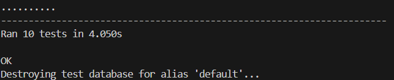
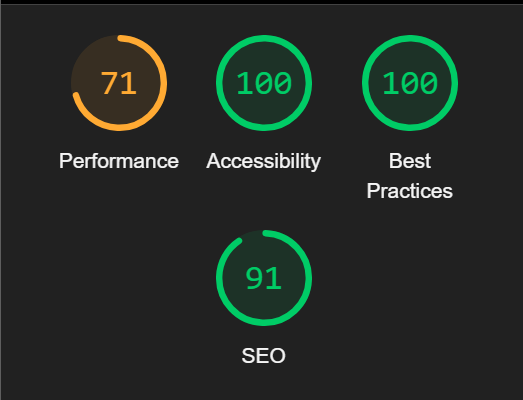

# Testing

# Contents

- [Functional Testing](#functional-testing)
    - [Authentication](#authentication)
    - [Forms - Experienced](#forms---experienced)
    - [Forms - Courses](#forms---courses)
    - [Forms - Tandems](#forms---tandems)
    - [Navigation Links](#navigation-links)
    - [Admin Privileges](#admin-privileges)
- [Unit Testing](#unit-testing)
- [Accessibility](#accessibility)
- [Validator Testing](#validator-testing)
    - [w3 HTML Validator](#w3-html-validator)
    - [Pep8](#pep8)
    - [JSHINT](#jshint)
- [Lighthouse Report](#lighthouse-report)
- [Responsiveness](#responsiveness)

## Functional Testing

### Authentication

**Ensure a user can sign up to the website**

**Steps:**

1. Navigate to [book a skydive](https://book-a-skydive-3bb0c8212a26.herokuapp.com/) and click Register
2. Enter email, username, and password 
3. Click Sign up

**Expected:**

You are now logged in and redirected to the Home Page with a notification at the top to confirm login.

**Actual:**

You are now logged in and redirected to the Home Page with a notification at the top to confirm login.

---

**Ensure a user can log in to the website**

**Steps:**

1. Navigate to [book a skydive](https://book-a-skydive-3bb0c8212a26.herokuapp.com/) and click login
2. Enter username and password
3. Click Sign In

**Expected:**

You are now logged in and redirected to the Home Page with a notification at the top to confirm login.

**Actual:**

You are now logged in and redirected to the Home Page with a notification at the top to confirm login.

---

**Ensure a user can sign out of the website**

**Steps:**

1. Log in to the website
2. Click Log out
3. Click Sign Out (to confirm)
4. User is logged out, notification message should be visible

**Expected:**

You are now Logged out and redirected to the Home Page with a notification at the top to confirm logout.

**Actual:**

You are now logged out and redirected to the Home Page with a notification at the top to confirm logout.

---

### Forms - Experienced

**Ensure a logged in user can book a skydive within the experienced area**

**Steps:**

1. Log in, click the experienced link
2. Click 'book now' on relevant departure
3. Select jump type using the dropdown
4. Click book now

**Expected:**

Page reloads and displays a notification message confirmation.

**Actual:**

Page reloads and displays a notification message confirmation.

---

**Ensure a logged in user can edit a skydive booking within the experienced area**

**Steps:**

1. Log in, click the experienced link
2. Click 'book now' on relevant departure
3. Select jump type using the dropdown
4. Select update booking

**Expected:**

Page reloads and displays a notification message confirmation.

**Actual:**

Page reloads and displays a notification message confirmation.

---

**Ensure a logged in user can delete a skydive booking within the experienced area**

**Steps:**

1. Log in, click the experienced link
2. Click 'book now' on relevant departure
3. Select delete booking
4. Click delete in confirmation modal

**Expected:**

Page reloads and displays a notification message confirmation.

**Actual:**

Page reloads and displays a notification message confirmation.

---

### Forms - Courses

**Ensure a logged in user can create a Course booking within the Courses area**

**Steps:**

1. Log in, click the courses link
2. Click book now on relevant course
3. Enter Full name, email, phone number, weight, and height
4. Select confirm booking

**Expected:**

Redirected to the booking success page.

**Actual:**

Redirected to the booking success page.

---

**Ensure a logged in user can edit a course booking within the profile area**

**Steps:**

1. Log in, click the Profile link
2. Under current bookings, click edit on the relevant booking
3. Make changes to the form
4. Click save changes

**Expected:**

Page reloads, notification confirming the change.

**Actual:**

Page reloads, notification confirming the change.

---

**Ensure a logged in user can delete a course booking within the profile area**

**Steps:**

1. Log in, click the Profile link
2. Under current bookings, click delete on the relevant booking

**Expected:**

Page reloads, notification confirming the change. Course is no longer visible within profile page.

**Actual:**

Page reloads, notification confirming the change. Course is no longer visible within profile page.

---

### Forms - Tandems

**Ensure a logged in user can create a Tandem booking within the Tandem area**

**Steps:**

1. Log in, click the Tandems link
2. Select a day, click next
3. Select a time, click next
4. Enter Full name, email, phone number, weight, and height
5. Select confirm booking

**Expected:**

Redirected to the booking success page.

**Actual:**

Redirected to the booking success page.

---

**Ensure a logged in user can edit a Tandem booking within the profile area**

**Steps:**

1. Log in, click the Profile link
2. Under current bookings, click edit on the relevant booking
3. Make changes to the form
4. Click save changes

**Expected:**

Page reloads, notification confirming the change.

**Actual:**

Page reloads, notification confirming the change.

---

**Ensure a logged in user can delete a Tandem booking within the profile area**

**Steps:**

1. Log in, click the Profile link
2. Under current bookings, click delete on the relevant booking

**Expected:**

Page reloads, notification confirming the change. Tandem booking is no longer visible within profile page.

**Actual:**

Page reloads, notification confirming the change. Tandem booking is no longer visible within profile page.

---

### Navigation Links

Testing was performed to ensure all navigation links on the respective pages navigated to the correct pages as per design.

- Home -> index.html
- Tandems -> select_day.html
- Courses -> list_courses.html
- Experienced -> experienced/index.html
- Profile -> userprofile.html
- Contact Us -> contact.html
- Logout -> Sign out all auth page
- Login -> Sign in all auth page
- Register -> Sign up all auth page

All navigation links directed to the correct pages as expected.

---

### Admin Privileges

**Ensure a superuser can add a Course**

**Steps:**

1. Navigate to the admin url
2. Log in
3. Click 'add' for the aff courses model
4. Fill in fields and click Save
5. Navigate to the courses url

**Expected:**

Newly added course is visible on the courses url.

**Actual:**

Newly added course is visible on the courses url.

---

**Ensure a superuser can add a Tandem date/timeslot**

**Steps:**

1. Navigate to the admin url
2. Log in
3. Click 'add' for the tandem days model
4. Fill in fields and click Save
5. Click 'add' for the tandem timeslot model
6. Fill in fields and click Save

**Expected:**

Newly added tandem is visible on the dropdown menu with available time slots.

**Actual:**

Newly added tandem is visible on the dropdown menu with available time slots.

---

**Ensure a superuser can add an Experienced plane departure**

**Steps:**

1. Navigate to the admin url
2. Log in
3. Click 'add' for the 'jumpslots' model
4. Fill in fields and click Save
5. Navigate to the experienced url

**Expected:**

Newly added departure is visible on the experienced url.

**Actual:**

Newly added departure is visible on the experienced url.

---

## Unit testing

These tests check the validity of forms by ensuring that it behaves correctly with both valid and invalid input. One test verifies that the form is valid when provided with correct data, while the other confirms that the form rejects incorrect data.

They also validate different aspects of a few views. One test checks that the plane detail page renders properly with the booking form, while another ensures that a booking can be successfully submitted. There are also tests within the experienced app for editing an existing booking to verify the update functionality, and for deleting a booking to confirm that a user can remove their own booking.

I did also come across the issue that after having making my tests I then had to change my code due to new functionality (users had to be logged in to book a course), I learnt that maintaining tests is another important part of development. After these fixes the Unit tests now pass.

---

## Accessibility

[Wave Accessibility](https://wave.webaim.org/) tool was used throughout development and for final testing of the deployed website to check for any aid accessibility testing.

Testing was focused to ensure the following criteria were met:

- All forms have associated labels or aria-labels so that this is read out on a screen reader to users who tab to form inputs
- Color contrasts meet a minimum ratio as specified in [WCAG 2.1 Contrast Guidelines](https://www.w3.org/WAI/WCAG21/Understanding/contrast-minimum.html)
- Heading levels are not missed or skipped to ensure the importance of content is relayed correctly to the end user
- All content is contained within landmarks to ensure ease of use for assistive technology, allowing the user to navigate by page regions
- All non-textual content had alternative text or titles so descriptions are read out to screen readers
- HTML page lang attribute has been set
- Aria properties have been implemented correctly
- WCAG 2.1 Coding best practices being followed

---

## Validator testing

**w3 HTML Validator**

All pages were run through the [w3 HTML Validator](https://validator.w3.org/nu/). All of these issues were corrected and all pages passed validation.

**Pep8**
All pages were run through the official [Pep 8](https://pep8ci.herokuapp.com/#)
 validator to ensure all code was pep8 compliant. Some errors were shown due to blank spacing and lines too long, 1 line instead of 2 expected. All of these errors were resolved and code passed through the validator.

**JSHINT**
JavaScript code was run through JSHINT javascript validator. There were a few semi colons i had missed, these were added and collectstatic was run again to ensure that the next deployment of code would include the new javascript.

## Lighthouse report

Lighthouse highlighted the slow loading times of the large hero images. These are webp images and would require a more technical solution which can be looked at in the future. I decided the load times were more than okay and that high quality images were important for the business.

## Responsiveness
All pages were tested to ensure responsiveness on screen sizes from 320px and upwards as defined in WCAG 2.1 Reflow criteria for responsive design on Chrome, Edge, Firefox and Opera browsers.

Steps to test:

- Open browser and navigate to [book a skydive](https://book-a-skydive-3bb0c8212a26.herokuapp.com/)
- Open the developer tools (right click and inspect)
- Set to responsive and decrease width to 320px
- Set the zoom to 50%
-  Click and drag the responsive window to maximum width

Expected:

Website is responsive on all screen sizes and no images are pixelated or stretched. No horizontal scroll is present. No elements overlap.

Actual:

Website behaved as expected.

## Bug Fixes
1. Javascript wasn’t working correctly in deployed code, I noticed using the response from the javascript file that was fetched that it was the old JS file and that I needed to run collectstatic in order for the new one to be deployed.
I then also had to add the script back that I thought I did not need in order for the bootstrap modal to work correctly.

2. Adding correct error messages to forms, they were throwing an error stopping the user from submitting without explaining the specific error. More error handling was implemented to solve this.

3. When pressing the edit button on the experienced bookings in the profile page, the book now button did not update to the expected 'update booking'. I found it was navigating to the incorrect url path. After changing it to direct to the correct url pattern and ensuring the correct parameters were passed the update booking button was visible.
